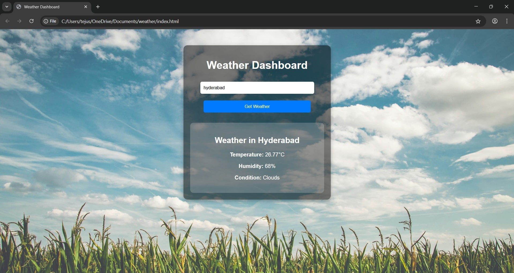

# 🌤️ Weather Dashboard

A responsive and clean web application that fetches real-time weather data for any city using the OpenWeatherMap API. Built using HTML, CSS, and JavaScript, this app is ideal for understanding how APIs work and how to create interactive dashboards.

---

## Project Description

This Weather Dashboard allows users to:
- Enter the name of any city
- View the current **temperature**, **humidity**, and **weather condition**
- Enjoy a cloud-themed background
- Use it on both desktop and mobile (fully responsive)

---

## Features

- Real-time data using OpenWeatherMap API
- Displays temperature, humidity, and weather forecast
- Fully responsive for mobile and tablet
- Cloud-themed background for a modern look
- User-friendly interface

---

## Technologies Used

- **HTML** – Structure
- **CSS** – Styling and responsiveness
- **JavaScript** – Fetching API data and dynamic content
- **OpenWeatherMap API** – Weather data source

---

## 📸 Weather Dashboard



---

### 1️ Clone the Repository

```bash
git clone https://github.com/YOUR_USERNAME/weather-dashboard.git
cd weather-dashboard
```
### 2 Get an API Key from OpenWeatherMap

```bash
https://openweathermap.org/api
```
### 3 nsert Your API Key into the Code
```bash
const apiKey = "YOUR_API_KEY";
```
### 4 Run the app
```bash
# On Windows (Explorer):
start index.html

# On macOS:
open index.html

# Or manually double-click the file in your file explorer
```


